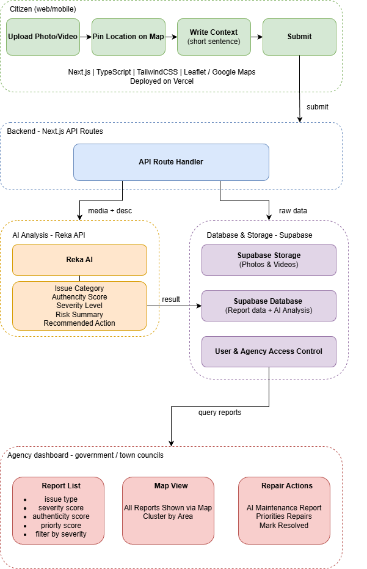
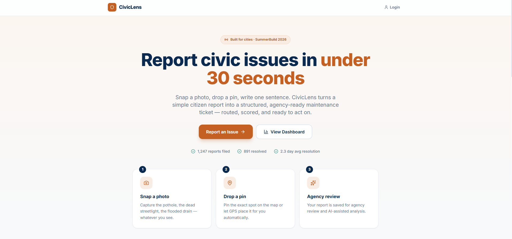
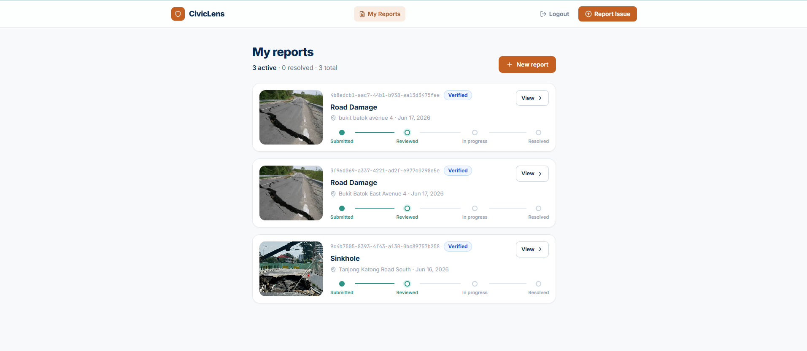
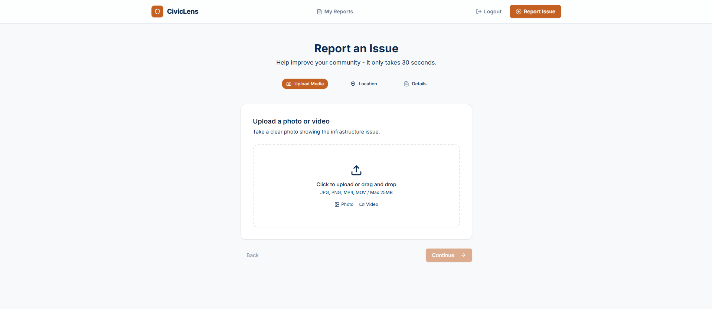
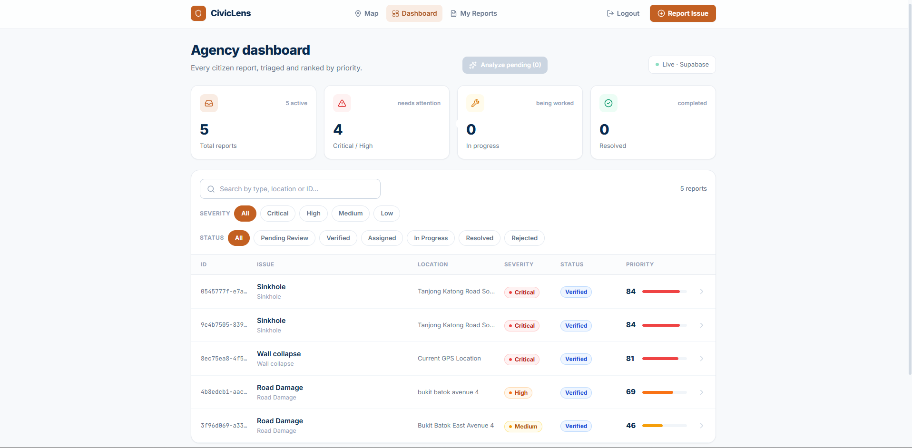
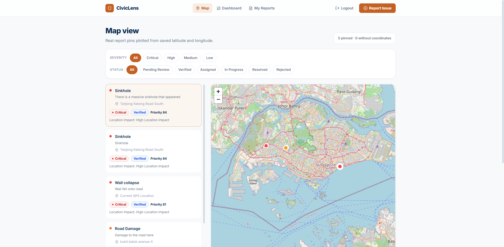

# CivicLens

> AI-powered civic infrastructure reporting platform built for SummerBuild 2026.

## Team

**Team Name:** The Musketeers

| Member | Role |
| --- | --- |
| Member 1 | Frontend Lead |
| Thant Zaw *(ThantZaw-cs)* | AI / Reka Integration |
| Member 3 | Backend & Database |
| Paarthiban Nadimuthu | Product & Research |

## Problem

Current civic reporting platforms are slow and frustrating for both citizens and agencies.

Citizen-side pain points:

- Reporting infrastructure issues takes too long
- Users often need to choose categories manually
- Reports vary wildly in clarity and detail
- Smaller issues are often never submitted

Agency-side pain points:

- Large report volumes still require manual review
- Duplicate submissions waste maintenance resources
- Urgency is difficult to assess consistently
- Unstructured data makes prioritization harder

## Solution

CivicLens reduces reporting friction to a simple flow:

1. Upload a photo or video
2. Enter a location
3. Write a short description
4. Submit

The platform then turns that simple input into structured maintenance data:

- Detect likely issue type
- Estimate severity
- Score authenticity
- Recommend the responsible agency
- Generate a professional maintenance report
- Prioritize what should be addressed first

> CivicLens is not designed to replace existing platforms such as OneService. Instead, it explores an AI-assisted layer for civic reporting: helping citizens submit simpler reports while helping agencies convert those reports into structured, prioritised maintenance cases.

## Priority Scoring System

CivicLens uses an explainable 0-100 priority score so agencies can see why one
report ranks above another. The ranking is transparent and rule-based, not a
pure black-box AI decision.

```txt
Priority Score =
Severity Score + Authenticity Contribution + Duplicate Contribution + Location Impact Contribution
```

Weights:

- Severity, max 60: low = 10, medium = 25, high = 45, critical = 60.
  Safety risk matters most.
- Authenticity, max 15: `authenticity_score * 0.15`.
  Trustworthy reports rank higher, but authenticity does not overpower safety.
- Duplicates, max 15: `Math.min(duplicate_count * 3, 15)`.
  Repeated citizen reports suggest wider impact, capped so duplicates do not
  outrank critical hazards by themselves.
- Location Impact, max 10: estimated from report description, location text,
  category, and the `congestion_impact` field.
  CivicLens labels this in the UI as "Location Impact" or
  "Congestion / Location Impact".

Location impact currently uses text and location keywords, not live traffic
data. Examples include MRT/train station, hospital, expressway, school zone,
bus stop, pedestrian crossing, mall, market, HDB, carpark, park, walkway, side
road, and similar civic context clues. Future improvements can plug in
geocoding, map data, footfall estimates, public transport proximity, or
government GIS layers.

## Map and Location

Reports store both human-readable `location_text` and optional `latitude` /
`longitude`. The map only plots pins for reports that have real coordinates;
reports without coordinates still appear in the map sidebar with a "No
coordinates yet" note.

Citizens can add coordinates during report submission by clicking the map picker
or using the browser's current location prompt. Coordinates are encouraged for
map display, but they are not required to submit a report.

Future versions can add geocoding with OneMap, Google Maps, public transport
proximity, footfall data, or government GIS datasets so typed locations can be
converted into reliable coordinates automatically.

## Reka AI Analysis

Reka is used server-side only. The browser calls
`POST /api/reports/[id]/analyze`, and the Next.js API route reads
`REKA_API_KEY` from the server environment. The key is never exposed to client
components.

The agency/admin AI analysis route sends the report media and text context to
Reka:

- `media_url`
- `media_type`
- `description`
- `location_text`
- `category`

Reka returns structured report fields:

- `issue_type`
- `severity`
- `authenticity_score`
- `congestion_impact` / location impact label
- `responsible_agency`
- `agency_reason`
- `routing_confidence`
- `recommended_action`
- `ai_summary`

The backend validates and sanitizes the response before saving it. Severity must
be one of `low`, `medium`, `high`, or `critical`; authenticity is clamped to
0-100; and all text fields have safe fallback values. If `REKA_API_KEY` is not
configured, CivicLens uses an isolated mock analysis fallback so hackathon demos
can still run.

For the MVP, agency routing is a recommendation rather than a hard assignment.
The AI suggests a Singapore routing owner such as LTA, PUB, NParks, NEA,
HDB / Town Council, SCDF, SPF, or Municipal Services Office. To avoid schema
churn, the recommendation is saved inside the existing `recommended_action` and
`ai_summary` fields. A future version can promote this into dedicated
`responsible_agency`, `agency_reason`, and `routing_confidence` columns for
filtering and workflow assignment.

Reka does not directly decide `priority_score`. After AI fields are generated,
the backend recalculates priority with `lib/priority.ts`, keeping the final
agency ranking transparent and explainable.

## System Architecture


## Project Status

CivicLens is a working MVP prototype built for SummerBuild 2026. The current version includes:

Next.js App Router frontend
TailwindCSS-based UI
Landing page at /
Submit page at /submit
Dashboard page at /dashboard
Agency report details page at /report/[id]
Citizen confirmation page at /report/[id]/result
Shared navigation and reusable report components
Supabase-backed authentication, report submission, storage, dashboard, map, and details screens
Server-side Reka AI analysis for agency/admin report review
Leaflet-based map picker and agency map view with real report coordinates

The app is deployed on Vercel and demonstrates the full citizen-to-agency reporting flow

## Live Demo

CivicLens is deployed on Vercel:

https://civic-lens-delta.vercel.app/

The deployed app connects to Supabase for authentication, report storage, media uploads, map data, and role-based access. Reka AI analysis runs through server-side Next.js API routes, so API keys are not exposed to the browser.

## Demo Flow

1. A citizen signs up or logs in.
2. The citizen submits a report with media, location, and description.
3. The report is saved as `Pending Review`.
4. An agency/admin user opens the dashboard and clicks `Analyze pending`.
5. CivicLens runs AI-assisted analysis, estimates severity, recommends an agency, detects likely duplicates, calculates priority, and marks analyzed reports as `Verified`.
6. The agency can then assign, update, and track the report through resolution.

## Screenshots
### Landing Page


### My Reports


### Report Page


### Agency Dashboard


### Agency Heatmap


## Demo Account Roles

Public signup always creates a `profiles` row with `role = 'citizen'`.
For the MVP, agency/admin accounts are created by signing up normally, then
manually changing `profiles.role` from `citizen` to `agency` or `admin` in
Supabase.

## Starter Structure

```txt
app/
  dashboard/
    page.tsx
  report/
    [id]/
      page.tsx
      result/
        page.tsx
  submit/
    page.tsx
  globals.css
  layout.tsx
  page.tsx
components/
  Navbar.tsx
  ReportCard.tsx
  ReportForm.tsx
  SeverityBadge.tsx
lib/
  priority.ts
  reports.ts
  supabase.ts
```

## Next Steps

- Improve location impact with map/geocoding, footfall, transport, or GIS data
- Add richer agency assignment workflows
